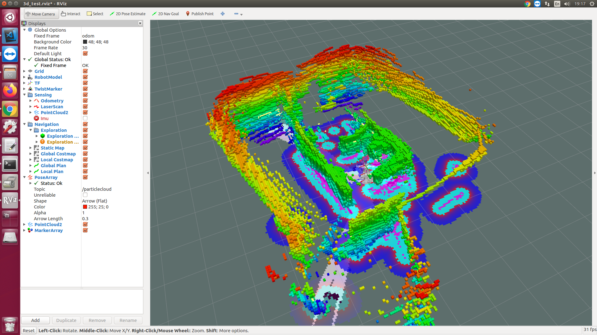
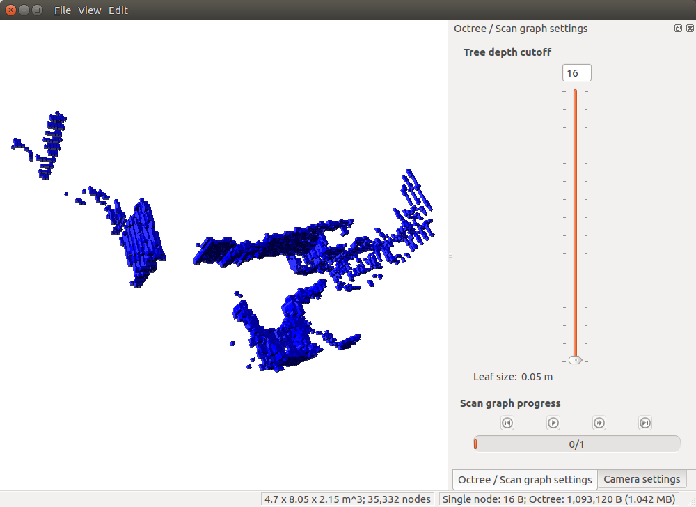

## file
[package + bag](https://drive.google.com/open?id=1iKgyq1D5ZyNDGZPlzhnzKw2kQ470PlaF)

## 3d slam LeGO LOAM test
$ roslaunch velodyne_pointcloud VLP16_points.launch
$ roslaunch lego_loam run.launch
* 若使用實際雷射記得關閉模擬時間
```bash
<param name="/use_sim_time" value="false" />
```

### play topic
```bash
$ rosbag play *.bag --clock --topic /velodyne_points /imu/data
$ rosbag play test.bag --topic /velodyne_points
```

### 3d to 2d navigation
* 如果要使用雷射,改變frame_id為laser
    * navigation/velodyne/velodyne_pointcloud/cfg/CloudNode.cfg
    ```bash
    gen.add("fixed_frame", str_t, 0, "The desired input frame", "laser")
    gen.add("target_frame", str_t, 0, "The desired output frame", "laser")
    ```
* 改變velodyne UDP package  
93行確定為754
```bash
  else if (config_.model == "VLP16")
    {
      packet_rate = 754;             // 754 Packets/Second for Last or Strongest mode 1508 for dual (VLP-16 User Manual)
      model_full_name = "VLP-16";
    }
```
   * 若使用cartographer可以改為packet_rate = 1;
      * lua參數TRAJECTORY_BUILDER_3D.num_accumulated_range_data改為100  

```bash
$ roslaunch velodyne_pointcloud VLP16_points.launch
若確定imu安裝正確,可以使用imu(fsm9.launch )
launch內可以修改topic與frame_id
$ roslaunch imu_3d fsm9.launch 
$ roslaunch pointcloud_to_laserscan point_to_scan.launch
$ roslaunch navigation 3d_navigation_by_laser_slam.launch
$ roslaunch rosbridge_server rosbridge_websocket.launch
$ rosrun motion fira6
```

### 儲存3d地圖
```
$ rosrun octomap_server octomap_saver test.ot
```
* 查看

```
$ octovis test.ot
```

## 參考資料
[1] [How to connect VLP-16 (confused about the tutorial)](https://answers.ros.org/question/261416/how-to-connect-vlp-16-confused-about-the-tutorial/)  
[2] [LOAM:3D激光里程计及环境建图的方法和实现（一）](https://zhuanlan.zhihu.com/p/29719106)  
[3] [LOAM: Lidar Odometry and Mapping in Real-time](http://www.roboticsproceedings.org/rss10/p07.pdf)  
[4] [LOAM使用总结](https://blog.csdn.net/weixin_37954144/article/details/100114713)  
[5] [LeGO-LOAM 编译安装与运行](https://blog.csdn.net/qq_36396941/article/details/83513121)  
[6] [LeGO-LOAM學習](https://www.twblogs.net/a/5c867069bd9eee35fc143015)  
[7] [LeGO-LOAM 编译安装与运行](https://blog.csdn.net/qq_36396941/article/details/83513121)  
[8] [LeGO-LOAM初探：原理，安装和测试](https://blog.csdn.net/learning_tortosie/article/details/86527542)  
[9] [3d laser topic bag](https://github.com/RobustFieldAutonomyLab/jackal_dataset_20170608)  
[10] [BLAM（Berkeley Localization And Mapping）安装使用教程 (gtsam編譯問題會用到)](https://blog.csdn.net/xmy306538517/article/details/81122663)  
[11] [LeGO-LOAM編譯、運行及其錯誤記錄(gtsam編譯問題會用到)](https://www.twblogs.net/a/5d092ed1bd9eee1e5c813363)  
[12] [Robosense 激光雷达slam建图（1）：在ROS上进行测试](https://blog.csdn.net/geerniya/article/details/84866429)  
