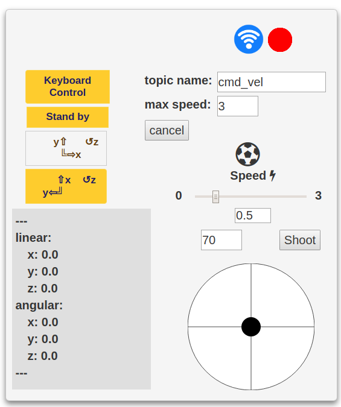
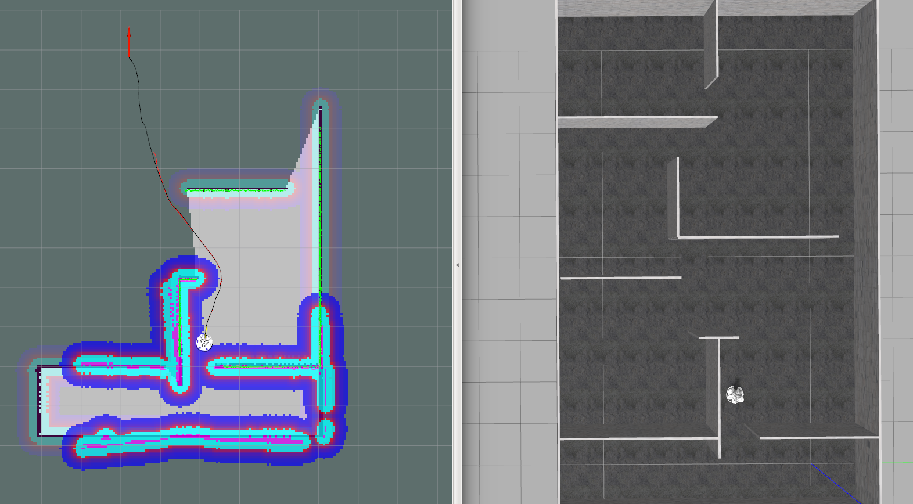
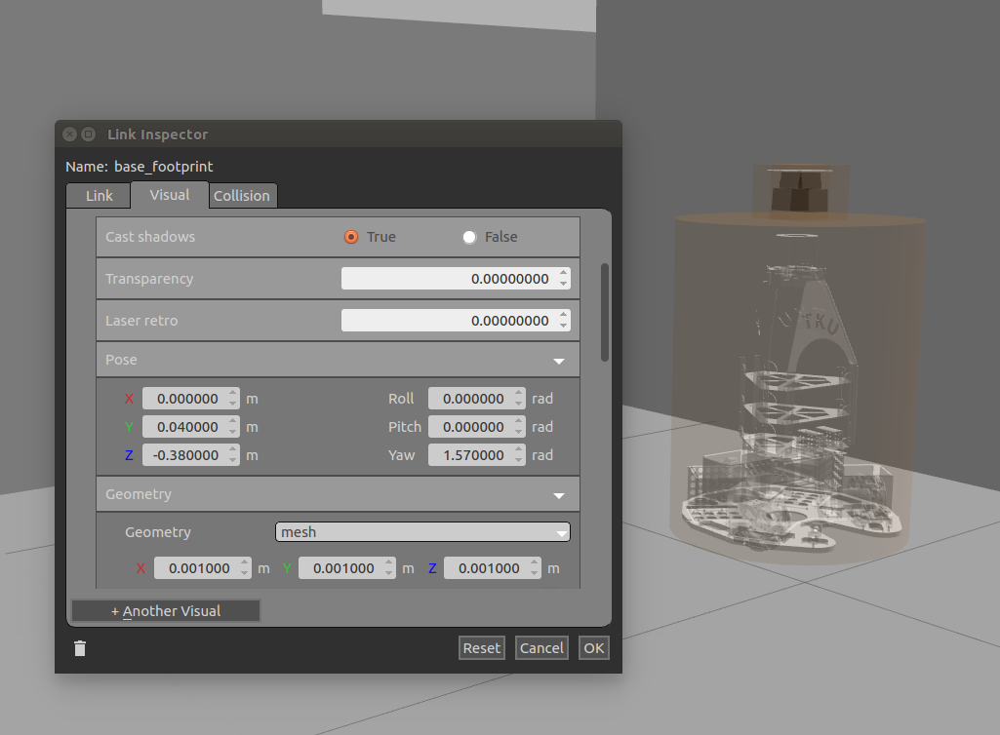

# Navigation Package
導航：從入門到放棄
<!-- TOC -->

- [Navigation Package](#navigation-package)
    - [實驗平台](#實驗平台)
    - [軟硬體安裝](#軟硬體安裝)
        - [編譯](#編譯)
        - [Hokuyo URG-04LX](#hokuyo-urg-04lx)
        - [HLDS HLS-LFCD LDS](#hlds-hls-lfcd-lds)
        - [FSM-9](#fsm-9)
    - [Motion](#motion)
    - [Hector SLAM](#hector-slam)
    - [SLAM + Navigation](#slam--navigation)
    - [AMCL + SLAM + Navigation](#amcl--slam--navigation)
    - [AMCL + odom + Navigation](#amcl--odom--navigation)
    - [GAZEBO](#gazebo)
    - [RobotModel替換](#robotmodel替換)
        - [urdf.xacro](#urdfxacro)
        - [gazebo.xacro](#gazeboxacro)
    - [雷射替換](#雷射替換)
    - [tf替換](#tf替換)
    - [navigation參數替換](#navigation參數替換)
    - [參考資料](#參考資料)

<!-- /TOC -->
<hr>

## 實驗平台
 * 雷射測距儀
   - Hokuyo URG-04LX  
   - HLDS HLS-LFCD LDS  
 * IMU 3D
   - FSM-9
 * ROS kinetic  
 * FIRA6B  

## 軟硬體安裝
### 編譯
  * 編譯前先把hokuyo_node拿出來catkin_make,完成後再放入編譯一次
  * 確定這些package都有安裝
    ```bash
    $ sudo apt-get install ros-kinetic-hector-map-tools
    $ sudo apt-get install ros-kinetic-hector-nav-msgs
    $ sudo apt-get install ros-kinetic-dynamixel-controllers
    $ sudo apt-get install ros-kinetic-move-base-msgs
    $ sudo apt-get install ros-kinetic-move-base
    $ sudo apt-get install ros-kinetic-dwa-local-planner
    $ sudo apt-get install ros-kinetic-urdf-sim-tutorial 
    $ sudo apt-get install ros-kinetic-map-server
    $ sudo apt-get install ros-kinetic-amcl
    $ sudo apt-get install octovis (3d 地圖)
    # check qt version
    $ qmake --version
    # if Qt version lower than 4
    $ sudo apt install qt4-default
    ```
### Hokuyo URG-04LX
  
  <strike> 

  ```bash
  * indigo：
  $ sudo apt-get install ros-indigo-hokuyo-node

  * kinetic：
  $ sudo apt-get install ros-kinetic-urg-node
  ```
  </strike> 

  * 使用package內的hokuyo_node   
  * Permission Problem  

    ```bash
    $ sudo vim /etc/udev/rules.d/99-hokuyo.rules

    edit or add the following line:
    KERNEL=="ttyACM[0-9]*", ACTION=="add", ATTRS{idVendor}=="15d1", MODE="0666", GROUP="dialout", SYMLINK+="sensors/hokuyo"

    重新連接USB  
    see on /dev/febot/laser & /dev/ttyACM[0-9]
    $ ls /dev/sensors/hokuyo
    ```

  * 啟動  
    ```bash
    $ roslaunch navigation hokuyo_node.launch
    ```
### HLDS HLS-LFCD LDS
  ```bash
  $ sudo apt-get install ros-kinetic-hls-lfcd-lds-driver
  $ sudo chmod a+rw /dev/ttyUSB0
  ```
  * 啟動
    ```bash
    $ roslaunch navigation hlds_laser.launch
    ```
  ### FSM-9
  ```bash
  $ cd src/imu_3d/rule/
  $ sudo cp imu.rules /etc/udev/rules.d
  打完指令後重新連接USB
  ```
  * 啟動
    ```bash
    $ rosrun imu_3d imu_3d
    ```

## Motion
  * 啟動

    ```bash
    $ rosrun motion fira6
    ```
  * 若更換平台需自行更換motion控制
    - navigation路徑規劃輸出topic name: /cmd_vel  
    - navigation座標系與fira足球機器人平台預設座標系不同（x'=y; y'=x）  
    - navigation輸出速度大小0-3.0 (max_vel_x)單位m/s  
    - fira足球機器人平台建議先調整（乘以30倍）再輸出到馬達,若未調整速度過慢將會無法移動  
        - 速度m/s轉換為PWM 大約乘以27.3 (fira6b)  
        - 轉換函式

          ```bash
          def ConvertSpeedToPWM(self, x, y):
            reducer = 24
            max_rpm = 7580
            wheel_radius  = 0.11
            circumference = 2 * math.pi * wheel_radius
            _x = (x / circumference * reducer * 60)/max_rpm * 100
            _y = (y / circumference * reducer * 60)/max_rpm * 100
            return _x, _y
          ```
  * 馬達控制介面  
     
    - 開啟rosbridge_websocket後，按上方wifi圖示連線
      ```bash
      $ roslaunch rosbridge_server rosbridge_websocket.launch 
      ```
    - 按照圖片更換座標系、topic name、max speed
    - cancel 按鈕用於navigation 取消正在移動的路徑規劃

## Hector SLAM  
  ```bash
  $ roscore
   # motion
  $ rosrun motion fira6
  $ roslaunch rosbridge_server rosbridge_websocket.launch 
  # laser
  $ roslaunch navigation hokuyo_node.launch
  # slam
  $ roslaunch hector_slam_launch test.launch
  ```

* 儲存地圖  
  - 地圖會存在Terminal所在目錄
    ```bash
    $ rosrun map_server map_saver
    ```
  - 指定儲存位置
    ```bash
    $ rosrun map_server map_saver -f /home/iclab/navigaion/src/navigaion/maps/fire_field
    ```

## SLAM + Navigation
  ```bash
  $ roscore
  # motion
  $ rosrun motion fira6
  $ roslaunch rosbridge_server rosbridge_websocket.launch 
  # laser
  $ roslaunch navigation hokuyo_node.launch
  # navigation
  $ roslaunch navigation navigation_by_laser_slam.launch
  ```
  * 點rviz介面上方 2D Nav Goal定終點位置 按住移動旋轉角度  

## AMCL + SLAM + Navigation
  ```bash
  $ roscore
  # motion
  $ rosrun motion fira6
  $ roslaunch rosbridge_server rosbridge_websocket.launch 
  # laser
  $ roslaunch navigation hokuyo_node.launch
  # amcl+navigation
  $ roslaunch navigation amcl_navigation_by_laser_slam.launch
  ```
  * 自行替換amcl_navigation_by_laser_slam.launch檔裡面的map檔案路徑  
    - 或者在指令內加入arg
      ```bash
      $ roslaunch navigation amcl_navigation_by_laser_slam.launch map:=${HOME}/navigation/src/navigation/maps/fire_field.yaml
      ```

## AMCL + odom + Navigation
  ```bash
  $ roscore
  # motion
  $ rosrun motion fira6
  $ roslaunch rosbridge_server rosbridge_websocket.launch
  # laser 
  $ roslaunch navigation hokuyo_node.launch
  # odom
  $ rosrun imu_3d imu_3d
  $ rosrun localization localization_node
  # amcl+navigation
  $ roslaunch navigation amcl_navigation_by_odom.launch
  ```
  * map路徑修改參考[AMCL + SLAM + Navigation](#amcl--slam--navigation)

## GAZEBO
   
  
  ```
  $ roslaunch fira6_gazebo fire_world.launch
  ```
  * Hector SLAM 
    ```bash
    # world
    $ roslaunch fira6_gazebo fire_world.launch
    # for web motion contorl
    $ roslaunch rosbridge_server rosbridge_websocket.launch
    # hector slam
    $ roslaunch hector_slam_launch test.launch 
    ```
  * SLAM + Navigation 
    ```bash
    # world
    $ roslaunch fira6_gazebo fire_world.launch
    # for web motion contorl
    $ roslaunch rosbridge_server rosbridge_websocket.launch
    # navigation
    $ roslaunch navigation navigation_by_laser_slam.launch
    ``` 
  * AMCL + SLAM + Navigation
    ```bash
    # world
    $ roslaunch fira6_gazebo fire_world.launch
    # for web motion contorl
    $ roslaunch rosbridge_server rosbridge_websocket.launch
    # navigation
    $ roslaunch navigation amcl_navigation_by_laser_slam.launch
    ``` 
  * AMCL + odom + Navigation
    ```bash
    # world
    $ roslaunch fira6_gazebo fire_world.launch odom:=true
    # for web motion contorl
    $ roslaunch rosbridge_server rosbridge_websocket.launch
    # navigation
    $ roslaunch navigation amcl_navigation_by_odom.launch
    ``` 

## RobotModel替換 
  用於rviz和gazebo模型顯示  
  開頭link name請統一base_footprint,用於tf與navigation  
### urdf.xacro
  ```bash
    <!-- root link, on the ground just below the model origin -->
    <link name="base_footprint">
    <visual>
        <origin xyz="0 0 0" rpy="0 0 0" />
        <geometry>
          <box size="0.001 0.001 0.001" />
        </geometry>
      </visual>
    </link>
    <joint name="world_joint" type="fixed">
      <origin xyz="0 0 0" rpy="0 0 0" />
      <parent link="base_footprint" />
      <child link="scanner_base"/>
    </joint>
  ```
  * 如果navigation的rviz介面robotmodel顯示不是在最上面,可以修改world_joint的z軸高度

  ```bash
  <origin xyz="0 0 0.3" rpy="0 0 0" />
  ```
  * 機器人模型顯示  

  ```bash
  <!-- the model -->
    <link name="scanner_base">
      <inertial>
        <mass value="50" />
        <origin xyz="0 0.04 -0.48" />
        <inertia ixx="12.75" ixy="0.0"   ixz="0.0"
                            iyy="12.75" iyz="0.0"
                                        izz="1.3225" />
      </inertial>
      <visual>
        <origin xyz="0 0.04 -0.68" rpy="0 0 1.57" />
        <!--origin xyz="0 0 -1.62" rpy="0 0 1.57" /-->
        <material name="white">
          <color rgba="1 1 1 1"/>
        </material>
        <geometry>
          <mesh filename="package://fira6_description/meshes/robot6th.stl" scale="0.001 0.001 0.001"/>
        </geometry>
      </visual>
      <collision>
        <origin xyz="0 0 0" />
        <geometry>
          <cylinder length="0.6" radius="0.23" />
        </geometry>
      </collision>
    </link>
  ```
  * 在gazebo內修改模型位置

   
  * mass標籤設定重量（kg）  
  * inertia參考wiki設定[List of 3D inertia tensors](https://en.wikipedia.org/wiki/List_of_moments_of_inertia#List_of_3D_inertia_tensors)  
  * cylinder設定長寬高  
  * mesh替換模型文件  

### gazebo.xacro
  * 設定摩擦力

  ```bash
    <gazebo reference="base_footprint">
      <mu1>0.5</mu1>
      <mu2>0.5</mu2>
      <kp>500000.0</kp>
      <kd>10.0</kd>
    </gazebo>
  ```
  * 雷射套件

  ```bash
    <plugin name="gazebo_ros_head_hokuyo_controller" filename="libgazebo_ros_laser.so">
      <topicName>/scan</topicName>
      <frameName>laser</frameName>
    </plugin>
  ```
  * ~~移動套件(protobuf3好像無法使用)~~
    - gazebo內建全向平台套件有問題,會影響模型重力加速度大小(下降變很慢),需要自行替換,可參考fira6_gazebo/src設定[k-okada/gazebo_ros_pkgs](https://github.com/k-okada/gazebo_ros_pkgs)

  ```bash
  <gazebo>
    <plugin name="object_controller" filename="libgazebo_ros_planar_move_fix.so">
      <commandTopic>/cmd_vel</commandTopic>
      <odometryTopic>odom</odometryTopic>
      <odometryFrame>odom</odometryFrame>
      <odometryRate>20.0</odometryRate>
      <robotBaseFrame>base_footprint</robotBaseFrame>
    </plugin>
  </gazebo>
  ```
## 雷射替換
  
  * 替換雷射記得將雷射frame_id設定為laser

  ```bash
  # 參考 navigation/include/hokuyo_node.launch
  <param name="frame_id" value="laser"/>
  ```

  ## tf替換
  * 修改navigation/launch/include/tf.launch
  - 依照機器人雷射安裝位置的修改tf

  ```bash
  <node pkg="tf" type="static_transform_publisher" name="base_frame_2_laser_link" args="0.1 0 0 0 0 0 /base_frame /laser 100"/>
  ```
## navigation參數替換
  * navigation/param/dwa_local_planner_params_(model).yaml
    - min_vel_x 若設為0,機器人不會倒退移動
    - max_vel_y min_vel_y 若為2輪平台,將y軸方向速度設為0
  * costmap_common_params_(model).yaml
    - footprint 設定機器人邊界 若為圓形平台可設定robot_radius參數
    - inflation_radius 人工力場距離範圍
    - cost_scaling_factor 人工力場的成本參數,愈大路徑規劃愈保守

## 參考資料
  [1] [（ROS探索1）UTM-30LX激光雷达安装使用](https://zhuanlan.zhihu.com/p/31539045)  
  [2] [LDS-01](http://emanual.robotis.com/docs/en/platform/turtlebot3/appendix_lds_01/#user-guide-for-embedded-board)  
  [3] [机器人描述--URDF和XACRO](https://blog.csdn.net/sunbibei/article/details/52297524)  
  [4] [List of 3D inertia tensors](https://en.wikipedia.org/wiki/List_of_moments_of_inertia#List_of_3D_inertia_tensors)  
  [5] [k-okada/gazebo_ros_pkgs](https://github.com/k-okada/gazebo_ros_pkgs)  
  [6] [hokuyo激光雷達URG-04LX用hector slam算法構建地圖（1）——準備工作](https://www.twblogs.net/a/5c32e825bd9eee35b21ccc8c)  
  [7] [hokuyo激光雷達URG-04LX用hector slam算法構建地圖（2）——整個流程](https://www.twblogs.net/a/5c3b4e7dbd9eee35b3a61130)  
  [8] [Turtlebot3 Navigation](http://emanual.robotis.com/docs/en/platform/turtlebot3/navigation/#run-navigation-nodes)
